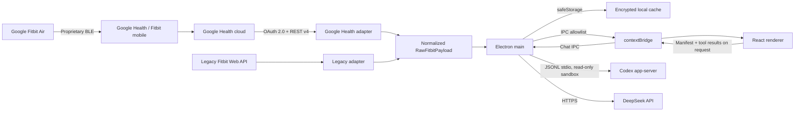

# Architecture

## Goals

- Fast desktop UI that remains useful without an account through demo data.
- Google Health API v4 as the primary provider, with the legacy Fitbit Web API isolated as a fallback.
- No tokens or secrets in the renderer.
- Partial consent and missing sensors must not block the dashboard.
- Encrypted per-day health archive and no upload to OpenFit services. Completed days are read locally without new provider requests. If `safeStorage` is unavailable, or Linux selects the unencrypted `basic_text` backend, saving fails explicitly.
- One normalization layer, so views do not depend on remote API shapes.
- Optional chat through Codex app-server or the DeepSeek API, selected in settings. Both are remote services: health data leaves the machine during a conversation, but nothing is sent until the user sends a message.

## Flow



## Security Boundaries

### Main Process

The main process is the only process allowed to:

- open the OAuth loopback server;
- know the Client Secret, access token, and refresh token;
- call `health.googleapis.com` and `api.fitbit.com`;
- read and write cache and credentials;
- open external URLs and export files only after explicit user action;
- start Codex app-server, or call the DeepSeek API over HTTPS, forwarding only the manifest and tool results prepared for the turn;
- hold the DeepSeek API key, encrypted via `safeStorage`, and the assistant provider choice; the renderer only ever receives `hasApiKey: boolean`;
- run the tool dispatcher's allowlist, call-count, timeout, and result-size checks on every tool call, in both directions, against `electron/assistant-tool-names.cjs` — main's own record of the six tools that exist, pinned by test against the real catalog in `src/lib/assistant-tools.ts`, never the `toolNames` the renderer sends alongside the turn;
- cap and shape-check the tool catalog (`input.tools`) forwarded into Codex's prose tool instructions, the one place a model treats OpenFit's own message as instructions rather than data.

### Preload

The preload exposes an operation allowlist through `contextBridge`. It does not expose Node, the filesystem, generic `ipcRenderer`, or tokens. Chat events are limited to status, text deltas, completion, errors, and cancellation.

### Renderer

The renderer runs with `nodeIntegration: false`, `contextIsolation: true`, and sandboxing enabled. It receives public status and credential-free health payloads, then builds the opening manifest and executes assistant tool calls before handing results back to main.

### Assistant providers

`assistant-codex.cjs` (renamed from `codex-service.cjs`) resolves the Codex Desktop executable, starts `codex app-server` over stdio, and reuses the local authentication. Every thread uses `read-only`, `approvalPolicy: never`, and disabled network access for its own shell/patch tools — those requests are still denied by the client. `assistant-deepseek.cjs` calls the DeepSeek API directly over HTTPS, against the fixed base URL `https://api.deepseek.com`; this is a literal in the source, not a setting, so a compromised or misconfigured config cannot redirect health data elsewhere. Fitbit and Google OAuth credentials never enter either provider's context. `assistant-config.cjs` persists the provider choice and the DeepSeek key (encrypted via `safeStorage`) and is the only place that reads the key back out.

Both providers are remote: Codex app-server talks to OpenAI's backend and DeepSeek talks to its own API. Health data leaves the machine once a conversation starts. Neither is contacted until the user sends a message.

### Tool layer

`src/lib/assistant-tools.ts` defines six read-only tools — `metric_window`, `compare_periods`, `correlate`, `explain_score`, `weekday_pattern`, `data_coverage` — that compute aggregates over the local `History` and scores rather than returning raw archive rows. Metric names are checked against an own-property-guarded allowlist because they arrive from a model that has read user-supplied text. `src/lib/analytics.ts` supplies the Spearman rank correlation and per-weekday medians behind two of those tools.

`electron/assistant-dispatch.cjs` is the guard between model and tools: a closed allowlist of tool names (`electron/assistant-tool-names.cjs`, main's own list, not anything the renderer sent), 8 calls per turn, a 5000 ms timeout per call, and a 4096-byte cap on each serialized result. `call()` never rejects — every failure mode (unknown tool, bad arguments, timeout, oversized result) comes back as `{ ok: false, error }` so a turn can continue instead of crashing. The dispatcher checks that arguments are a plain JSON object; it does not validate them against each tool's JSON Schema — that schema is authored in `src/lib/assistant-tools.ts` alongside the tool it describes, and each tool validates its own arguments (metric names, date ranges, enum values) before doing anything with them, the way `readMetric`/`readRange` in that file do.

The two providers request tools differently. DeepSeek gets them through the native OpenAI-style `tools` field. Codex app-server has no mechanism to declare custom tools (see `docs/superpowers/notes/2026-07-31-codex-tool-spike.md`), so `assistant-directives.cjs` parses a text convention instead: a trailing `<!-- openfit:tool {"name":...,"args":...} -->` HTML comment in the reply. Each directive costs Codex a full turn, and the parser accepts at most one call per reply.

Tools execute in the renderer, not in main, which looks backwards for a process that is supposed to hold the security boundary. The tools, the `History` type, and the score functions are TypeScript under `src/`; `main.cjs` is CommonJS and cannot import them. Reimplementing that normalization stack in main just to run tools there was rejected as duplication with no security benefit — main still holds the only API key and the only model connection, and still validates every tool call in both directions through the dispatcher above. What moved to the renderer is computation over already-normalized, already-local data, not custody of anything secret.

`src/lib/assistant-manifest.ts` replaced the archive dump that opened every conversation. For the archive, it reports what data exists and over what range rather than the values themselves; it also includes the currently selected day's figures and its three scores, so the assistant can talk about what is already on screen without spending a tool call, and leaves the model to pull anything beyond that through the tools above. It carries the profile timezone but never the display name, and reduces sync coverage to counts and error keys, never the raw upstream error text. Against the demo dataset (365 days) the manifest is about 1300 characters; the archive dump it replaced was allowed to grow past 500,000. `main.cjs` now caps the health context it will forward to either provider at 50,000 characters — headroom over the demo manifest for a longer-running real archive, not room for a dump.

## Provider Contract

Each adapter implements:

```text
createPkce()
createAuthorizationUrl(config, state, pkce)
exchangeAuthorizationCode(config, code, verifier)
refreshAccessToken(config, token)
revokeToken(token)
syncData(accessToken, date, onProgress)
```

The main process selects the adapter from `config.provider`. The UI always receives the same `RawFitbitPayload` contract, then `normalizeFitbitData` converts it into `DashboardData`.

## Resilience

- API reads are independent. A 403 or 404 response for ECG or temperature does not cancel steps and sleep.
- Each error is tied to its source and shown on the Devices page.
- Google Health is limited to fewer than five requests per second. `429` responses receive a retry with backoff.
- The token is refreshed before expiry. Rotated refresh tokens are saved atomically.
- Encrypted writes use a temporary file plus rename to avoid partial caches.
- A mostly failed sync does not replace the latest valid cache, and concurrent syncs are serialized.

## Deliberate Decisions

1. **No reverse-engineered BLE.** It is not a supported interface and would make pairing and data access fragile or unsafe.
2. **System browser for OAuth.** No Google or Fitbit password passes through Electron.
3. **Dual provider.** This matches Google's recommended migration strategy, and the renderer does not contain API branching.
4. **Demo first.** Visual development and tests do not require real health data.
5. **Read-only scopes.** OpenFit does not modify the user's health profile.

## Public Distribution Note

The documented Google Health client is a Web client and uses a Client Secret. `safeStorage` protects it on the user's computer, but a secret distributed inside a desktop app is not a true global secret. To distribute OpenFit to third parties, move the OAuth exchange to a minimal backend, complete Google verification, and complete the required security review. The current setup is appropriate for personal use and development.
